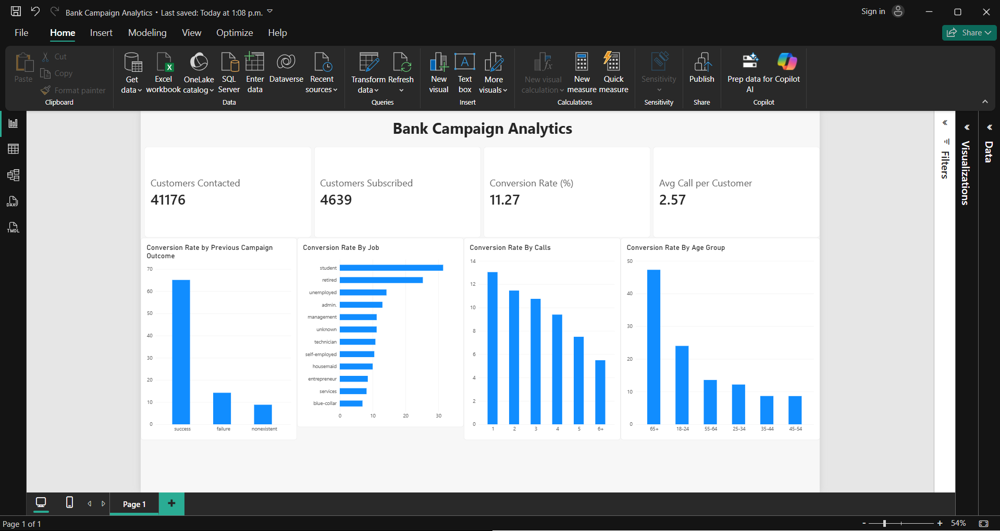

# Customer Campaign Analytics — ETL Pipeline + Power BI Dashboard

An end-to-end pipeline that takes raw bank marketing campaign data, cleans and validates it in Python, loads it into PostgreSQL, calculates campaign KPIs in SQL, and reports them in Power BI.

**Data:** UCI Bank Marketing dataset — 41,188 phone-campaign contacts from a Portuguese bank (2008–2010). Each row is one customer contacted, and whether they signed up for a term deposit.

```
bank-additional-full.csv ──► etl.py (pandas) ──► PostgreSQL ──► SQL KPI views ──► Power BI
      EXTRACT                 TRANSFORM + CHECKS       LOAD          ANALYZE           REPORT
```

## Dashboard



## Results

| KPI | Value |
|---|---|
| Customers contacted | 41,176 (after removing 12 duplicates) |
| Subscribed | 4,639 |
| Conversion rate | **11.27%** |
| Avg calls per customer | 2.57 |

**Key findings**
- **Past success is the strongest signal.** Customers who said yes to a previous campaign converted at **65%**, vs **9%** for never-contacted customers.
- **More calls = lower returns.** Conversion drops from **13%** on the 1st call to **5.5%** at 6+ calls.
- **Students (31%) and retirees (25%)** convert best; blue-collar converts lowest (6.9%).
- **Cell phone contacts convert ~3x better** than landline (14.7% vs 5.2%).
- **May had the most calls but the worst rate (6.4%)**; smaller months like Mar/Sep/Oct/Dec converted at 44–51%.

## Project structure

```
campaign-analytics/
├── data/
│   ├── bank-additional-full.csv   raw data
│   └── campaign_clean.csv         cleaned output
├── sql/
│   └── kpi_views.sql              7 KPI views
├── images/
│   └── dashboard.png              Power BI dashboard screenshot
├── Bank Campaign Analytics.pbix   Power BI report
├── etl.py                         the pipeline
├── requirements.txt
└── README.md
```

## What the pipeline does

**Extract** — reads the semicolon-separated CSV (downloads it if missing).

**Transform**
- Renames columns (`emp.var.rate` → `emp_var_rate`, `y` → `subscribed`)
- Trims and lowercases text
- Removes 12 exact duplicate rows
- Converts `subscribed` from yes/no to 1/0 so it can be averaged into a rate
- `pdays = 999` means "never contacted before" → set to NULL and added a `contacted_before` flag
- Adds `age_group`, `month_num`, `call_minutes`, and a `contact_id` key

**Validate** — 7 checks (unique IDs, no blanks in key columns, valid age range, 0/1 target, etc.). The pipeline stops if any fail. "unknown" answers are kept as their own category and counted.

**Load** — writes the table to PostgreSQL, adds a primary key, creates the KPI views, and confirms the database row count matches the cleaned data.

## How to run

1. Install PostgreSQL and create a database called `campaign_db` (in pgAdmin: right-click Databases → Create → Database).
2. Install the libraries:
   ```
   pip install -r requirements.txt
   ```
3. Run:
   ```
   python etl.py
   ```
   Enter your PostgreSQL password when asked.

## Power BI dashboard

Connect: **Get data → PostgreSQL database** → Server `localhost` → Database `campaign_db` → load `v_kpi_summary`, `v_by_age_group`, `v_by_job`, `v_by_month`, `v_by_calls`, `v_by_previous_outcome`, `v_by_contact`.

| Visual | Data |
|---|---|
| 4 KPI cards | `v_kpi_summary`: total_contacts, total_subscribed, conversion_rate_pct, avg_calls_per_customer |
| Column chart | `v_by_age_group`: age_group vs conversion_rate_pct |
| Bar chart | `v_by_job`: job vs conversion_rate_pct |
| Line + column | `v_by_month`: month (sort by month_num) — contacts as columns, conversion_rate_pct as line |
| Column chart | `v_by_calls`: calls_this_campaign vs conversion_rate_pct |
| Bar or donut | `v_by_previous_outcome` / `v_by_contact` |

## Tools
Python (pandas, SQLAlchemy) · PostgreSQL · SQL · Power BI

## Data source
Moro, S., Cortez, P., & Rita, P. (2014). *A Data-Driven Approach to Predict the Success of Bank Telemarketing.* UCI Machine Learning Repository.
